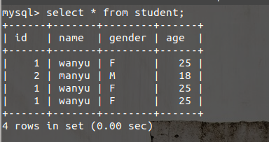
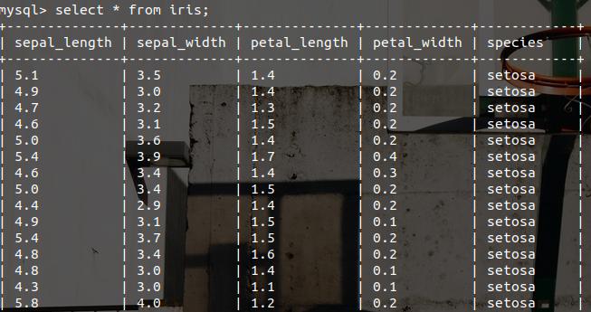

# PySpark之MySQL连接
说明：使用Spark SQL读写数据库Spark SQL可以支持Parquet、JSON、Hive等数据源，并且可以通过JDBC连接外部数据源。


```python
from findspark import init
init()
from pyspark import SparkConf, SparkContext
from pyspark.sql import SparkSession
import os
```


```python
spark = SparkSession.builder.appName("read_mysql").getOrCreate()
sc = spark.sparkContext
sc
```


## 从MySQL中读入数据
-　MySQL表中数据内容  



```python
jbdcDF = spark.read.format("jdbc")\
        .option("driver", "com.mysql.jdbc.Driver")\
        .option("url", "jdbc:mysql://localhost:3306/spark")\
        .option("dbtable", "student")\
        .option("user", "root")\
        .option("password", "123456").load()
```


```python
jbdcDF.show()
```

    +---+-----+------+---+
    | id| name|gender|age|
    +---+-----+------+---+
    |  1|wanyu|     F| 25|
    |  2|manyu|     M| 18|
    |  1|wanyu|     F| 25|
    |  1|wanyu|     F| 25|
    +---+-----+------+---+

## 向MySQL中写入数据


```python
iris = spark.read.csv("file://" + os.getcwd() + "/data/iris.csv", header=True)
iris.show(5)
```

    +------------+-----------+------------+-----------+-------+
    |sepal_length|sepal_width|petal_length|petal_width|species|
    +------------+-----------+------------+-----------+-------+
    |         5.1|        3.5|         1.4|        0.2| setosa|
    |         4.9|        3.0|         1.4|        0.2| setosa|
    |         4.7|        3.2|         1.3|        0.2| setosa|
    |         4.6|        3.1|         1.5|        0.2| setosa|
    |         5.0|        3.6|         1.4|        0.2| setosa|
    +------------+-----------+------------+-----------+-------+
    only showing top 5 rows


```python
#写入数据库
prop = {}
prop['user'] = 'root'
prop['password'] = '123456'
prop['driver'] = "com.mysql.jdbc.Driver"
iris.write.jdbc("jdbc:mysql://localhost:3306/spark",'iris','append', prop)
```

- 写入MySQL结果显示  


## 易错点
(1)Py4JJavaError: An error occurred while calling o92.load. : java.lang.Class......  
解决方法：[pyspark对Mysql数据库进行读写](https://zhuanlan.zhihu.com/p/136777424)  

(2)java.sql.SQLException: Access denied for user 'root@localhost'@'localhost'  
解决方法：
```python
mysql> ALTER USER 'root'@'localhost' IDENTIFIED WITH mysql_native_password BY 'password';
mysql> FLUSH PRIVILEGES;
```

## 参考

[厦门大学林子雨老师主讲《Spark编程基础（Python版）》](http://dblab.xmu.edu.cn/post/12157/#kejianxiazai)