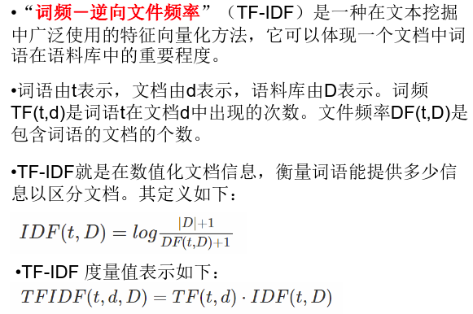

# PySpark之SparkMLlib基本操作
## 前言
Spark的引入:  
- 传统的机器学习算法，由于技术和单机存储的限制，只能在少量数据上使用，依赖于数据抽样
- 大数据技术的出现，可以支持在全量数据上进行机器学习
- 机器学习算法涉及大量迭代计算
- 基于磁盘的MapReduce不适合进行大量迭代计算
- 基于内存的Spark比较适合进行大量迭代计算  

Spark的优点:  
- Spark提供了一个基于海量数据的机器学习库，它提供了常用机器学习算法的分布式实现
- 开发者只需要有Spark 基础并且了解机器学习算法的原理，以及方法相关参数的含义，就可以轻松的通过调用相应的API 来实现基于海量数据的机器学习过程
- pyspark的即时查询也是一个关键。算法工程师可以边写代码边运行，边看结果  

MLlib:  
- MLlib是Spark的机器学习（Machine Learning）库，旨在简化机器学习的工程实践工作
- MLlib由一些通用的学习算法和工具组成，包括分类、回归、聚类、协同过滤、降维等，同时还包括底层的优化原语和高层的流水线（Pipeline）API，具体如下：
    1. 算法工具：常用的学习算法，如分类、回归、聚类和协同过滤；
    2. 特征化工具：特征提取、转化、降维和选择工具；
    3. 流水线(Pipeline)：用于构建、评估和调整机器学习工作流的工具;
    4. 持久性：保存和加载算法、模型和管道;
    5. 实用工具：线性代数、统计、数据处理等工具。  

MLlib和ML的区别:  
- spark.mllib包含基于RDD的原始算法API。Spark MLlib 历史比较长，在1.0 以前的版本即已经包含了，提供的算法实现都是基于原始的RDD
- spark.ml 则提供了基于DataFrames 高层次的API，可以用来构建机器学习工作流（PipeLine）。ML Pipeline 弥补了原始MLlib 库的不足，向用户提供了一个基于DataFrame 的机器学习工作流式API 套件


## 机器学习流水线
Pipline的使用：一个管道可以被认为由一系列不同阶段组成。在Pipeline对象上执行.fit()方法时，所有阶段按照stages参数中指定的顺序执行；stages参数是转换器和评估器对象的列表。管道对象的.fit()方法执行每个转化器的.transform()方法和所有评估器的.fit()方法。


```python
import findspark
findspark.init()
from pyspark.sql import SparkSession
from pyspark.ml.classification import LogisticRegression
from pyspark.ml.feature import HashingTF, Tokenizer, IDF
from pyspark.ml import Pipeline
```

```python
spark = SparkSession.builder.appName("word_count").master("local").getOrCreate()
training = spark.createDataFrame([(0, "a b c d e spark", 1.0)
                                  ,(1, "b d", 0.0)
                                  ,(2, "spark f g h", 1.0)
                                  ,(3, "hadoop mapreduce", 0.0)],
                                 ["id", "text", "label"]
                                )
training.show()
```

    +---+----------------+-----+
    | id|            text|label|
    +---+----------------+-----+
    |  0| a b c d e spark|  1.0|
    |  1|             b d|  0.0|
    |  2|     spark f g h|  1.0|
    |  3|hadoop mapreduce|  0.0|
    +---+----------------+-----+


```python
# A tokenizer that converts the input string to lowercase and then
# splits it by white spaces.(字符串转为小写，并split())
# 实例化
token = Tokenizer(inputCol="text", outputCol="words")
hashingTF = HashingTF(inputCol=token.getOutputCol(), outputCol="features")
lr = LogisticRegression(maxIter=10, regParam=0.001)
# 管道化
pipline = Pipeline(stages=[token, hashingTF, lr])
model = pipline.fit(training)
```


```python
# 测试数据集
test = spark.createDataFrame([(4, "spark i j k")
                              ,(5, "l m n")
                              ,(6, "spark hadoop spark")
                              ,(7, "apache hadoop")]
                             , ["id", "text"]
                            )

# 预测
predict = model.transform(test)
select  = predict.select("id", "text", "probability", "prediction")

for row in select.collect():
    rid, text, prob, prediction = row
    print("rid: {}, text: ({}), prob: {}, pred: {}".format(rid, text, prob, prediction))
```

    rid: 4, text: (spark i j k), prob: [0.1596407738787412,0.8403592261212588], pred: 1.0
    rid: 5, text: (l m n), prob: [0.8378325685476614,0.16216743145233858], pred: 0.0
    rid: 6, text: (spark hadoop spark), prob: [0.06926633132976266,0.9307336686702373], pred: 1.0
    rid: 7, text: (apache hadoop), prob: [0.9821575333444208,0.017842466655579203], pred: 0.0


## 特征装换
### TF-IDF
知识点:  
  
过程描述：  
1. 首先使用分解器Tokenizer把句子划分为单个词语
2. 对每一个句子（词袋），使用HashingTF将句子转换为特征向量
3. 最后使用IDF重新调整特征向量（这种转换通常可以提高使用文本特征的性能）


```python
sentenceData = spark.createDataFrame([(0, "I heard about Spark and I love Spark")
                                      ,(0, "I wish Java could use case classes")
                                      ,(1, "Logistic regression models are neat")
                                     ]).toDF("label", "sentence")
```


```python
# 分词
tokenizer = Tokenizer(inputCol="sentence", outputCol="words")
tokenDF = tokenizer.transform(sentenceData)
tokenDF.show()
```

    +-----+--------------------+--------------------+
    |label|            sentence|               words|
    +-----+--------------------+--------------------+
    |    0|I heard about Spa...|[i, heard, about,...|
    |    0|I wish Java could...|[i, wish, java, c...|
    |    1|Logistic regressi...|[logistic, regres...|
    +-----+--------------------+--------------------+


```python
# hashingTF：　TF表示t在文档中存在的次数
hashingTF = HashingTF(inputCol="words", outputCol="rawfeatures", numFeatures=2000)
hashingDF = hashingTF.transform(tokenDF)
hashingDF.select("words", "rawfeatures").show(truncate = False)
```

    +---------------------------------------------+---------------------------------------------------------------------+
    |words                                        |rawfeatures                                                          |
    +---------------------------------------------+---------------------------------------------------------------------+
    |[i, heard, about, spark, and, i, love, spark]|(2000,[240,673,891,956,1286,1756],[1.0,1.0,1.0,1.0,2.0,2.0])         |
    |[i, wish, java, could, use, case, classes]   |(2000,[80,342,495,1133,1307,1756,1967],[1.0,1.0,1.0,1.0,1.0,1.0,1.0])|
    |[logistic, regression, models, are, neat]    |(2000,[286,763,1059,1604,1871],[1.0,1.0,1.0,1.0,1.0])                |
    +---------------------------------------------+---------------------------------------------------------------------+


```python
# TF-IDF
idf = IDF(inputCol="rawfeatures", outputCol="features")
idfModel = idf.fit(hashingDF)
rescale_feature = idfModel.transform(hashingDF)
rescale_feature.select("features").show(truncate = True)
```

    +--------------------+
    |            features|
    +--------------------+
    |(2000,[240,673,89...|
    |(2000,[80,342,495...|
    |(2000,[286,763,10...|
    +--------------------+

### StringIndexer


```python
# StringIndexer字符转索引(LabelIndex)
from pyspark.ml.feature import StringIndexer
from pyspark.ml.feature import IndexToString, VectorIndexer, OneHotEncoder
from pyspark.ml.linalg import Vector, Vectors
```


```python
# data
df = spark.createDataFrame([(0, "a"), (1, "b"), (2, "c"), (3, "a"), (4, "a"), (5, "c")]
                           ,["id", "category"]
                          )

# index
string2index = StringIndexer(inputCol="category", outputCol="category2index")
model_string = string2index.fit(df)
df_index = model_string.transform(df)
df_index.show()
```

    +---+--------+--------------+
    | id|category|category2index|
    +---+--------+--------------+
    |  0|       a|           0.0|
    |  1|       b|           2.0|
    |  2|       c|           1.0|
    |  3|       a|           0.0|
    |  4|       a|           0.0|
    |  5|       c|           1.0|
    +---+--------+--------------+

### IndexToString


```python
# 还原回原来的的字符类别索引
index2string = IndexToString(inputCol="category2index", outputCol="original")
df_original = index2string.transform(df_index)
df_original.show()
```

    +---+--------+--------------+--------+
    | id|category|category2index|original|
    +---+--------+--------------+--------+
    |  0|       a|           0.0|       a|
    |  1|       b|           2.0|       b|
    |  2|       c|           1.0|       c|
    |  3|       a|           0.0|       a|
    |  4|       a|           0.0|       a|
    |  5|       c|           1.0|       c|
    +---+--------+--------------+--------+

### OneHotEncoder


```python
# 必须为数值型编码
onehot = OneHotEncoder(inputCol="category2index", outputCol="onthot_cate")
onehot = onehot.fit(df_original)
onehot_df = onehot.transform(df_original)
onehot_df.show()
```

    +---+--------+--------------+--------+-------------+
    | id|category|category2index|original|  onthot_cate|
    +---+--------+--------------+--------+-------------+
    |  0|       a|           0.0|       a|(2,[0],[1.0])|
    |  1|       b|           2.0|       b|    (2,[],[])|
    |  2|       c|           1.0|       c|(2,[1],[1.0])|
    |  3|       a|           0.0|       a|(2,[0],[1.0])|
    |  4|       a|           0.0|       a|(2,[0],[1.0])|
    |  5|       c|           1.0|       c|(2,[1],[1.0])|
    +---+--------+--------------+--------+-------------+

### VectorIndexer


```python
# 每一个vector是一个样本的特征向量，纵向编码
df = spark.createDataFrame([(Vectors.dense(-1.0, 1.0, 1.0),)
                            , (Vectors.dense(-1.0, 3.0, 1.0),)
                            , (Vectors.dense(0.0, 5.0, 1.0), )]
                           , ["features"]
                          )

# maxCategories表示超过此值后，不进行类别编码，dense_feat
vect2index = VectorIndexer(maxCategories=2, inputCol="features", outputCol="vect2index")
vect_model = vect2index.fit(df)
df_vect = vect_model.transform(df)
df_vect.show()
```

    +--------------+-------------+
    |      features|   vect2index|
    +--------------+-------------+
    |[-1.0,1.0,1.0]|[1.0,1.0,0.0]|
    |[-1.0,3.0,1.0]|[1.0,3.0,0.0]|
    | [0.0,5.0,1.0]|[0.0,5.0,0.0]|
    +--------------+-------------+

## LR


```python
import os 
from pyspark.ml.feature import VectorAssembler
from pyspark.ml.evaluation import MulticlassClassificationEvaluator
from pyspark.sql.types import FloatType, StringType, StructField, StructType
from pyspark.ml.classification import RandomForestClassifier


ROOT = os.getcwd()
```


```python
schema = StructType([StructField("sepal_length", FloatType())
                     , StructField("sepal_width", FloatType())
                     , StructField("petal_length", FloatType())
                     , StructField("petal_width", FloatType())
                     , StructField("label", StringType())
                    ]
                   )

df_iris = spark.read.csv("file://" + ROOT + "/data/iris.csv", schema=schema, header=True,)
df_iris.show(5)
```

    +------------+-----------+------------+-----------+------+
    |sepal_length|sepal_width|petal_length|petal_width| label|
    +------------+-----------+------------+-----------+------+
    |         5.1|        3.5|         1.4|        0.2|setosa|
    |         4.9|        3.0|         1.4|        0.2|setosa|
    |         4.7|        3.2|         1.3|        0.2|setosa|
    |         4.6|        3.1|         1.5|        0.2|setosa|
    |         5.0|        3.6|         1.4|        0.2|setosa|
    +------------+-----------+------------+-----------+------+
    only showing top 5 rows


```python
df_iris.printSchema()
```

    root
     |-- sepal_length: float (nullable = true)
     |-- sepal_width: float (nullable = true)
     |-- petal_length: float (nullable = true)
     |-- petal_width: float (nullable = true)
     |-- label: string (nullable = true)


```python
# A feature transformer that merges multiple columns into a vector column.
vector = VectorAssembler(inputCols=df_iris.columns[:-1], outputCol="features")
vector_df = vector.transform(df_iris)

# 类别编码
string_model = StringIndexer(inputCol="label", outputCol="index_label")
string_model = string_model.fit(vector_df)
string_df = string_model.transform(vector_df)

# 构成特征vector, label
df = string_df.select("features", "index_label")
df.show(5, truncate=False)
```


```python
# 训练LR模型
train_data, test_data = df.randomSplit([0.7, 0.3])
lr = LogisticRegression(featuresCol="features"
                        , labelCol="index_label"
                        , maxIter=100
                        , regParam=0.1
                        , elasticNetParam=0.8
                       )
model = lr.fit(train_data)

# index label转为真实索引值，测试集无标签
predict = model.transform(test_data)

index2string = IndexToString(inputCol="prediction", outputCol="label", labels=string_model.labels)
predict_df = index2string.transform(predict)
predict_df.select("features", "prediction", "label").show(5)
```

    +--------------------+----------+----------+
    |            features|prediction|     label|
    +--------------------+----------+----------+
    |[4.40000009536743...|       0.0|    setosa|
    |[4.59999990463256...|       0.0|    setosa|
    |[4.59999990463256...|       0.0|    setosa|
    |[4.80000019073486...|       0.0|    setosa|
    |[4.90000009536743...|       1.0|versicolor|
    +--------------------+----------+----------+
    only showing top 5 rows


```python
# 多分类的评估
multi_eval = MulticlassClassificationEvaluator(predictionCol="prediction"
                                               , labelCol="index_label"
                                              )
multi_eval.evaluate(predict_df)
```


    0.828395061728395


```python
model.coefficientMatrix
```


    DenseMatrix(3, 4, [0.0, 0.4267, -0.5337, -0.7243, 0.0, -0.5844, 0.0, 0.0, 0.0, 0.0, 0.1242, 1.1708], 1)


```python
model.numClasses
```


    3


```python
model.numFeatures
```


    4

## 参考
[林子雨主讲《大数据处理技术Spark》](http://dblab.xmu.edu.cn/post/12157/#kejianxiazai)  
[TF-IDF原理及使用](https://blog.csdn.net/zrc199021/article/details/53728499)  
[PySpark学习笔记-HashingTF()方法原理](https://blog.csdn.net/yeshang_lady/article/details/90200170)
