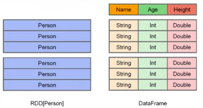
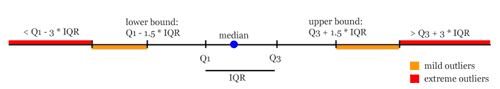

# SparkSQL

DataFrame的优点：
- DataFrame的推出，让Spark具备了处理大规模结构化数据的能力，不仅比原有的RDD转化方式更加简单易用，而且获得了更高的计算性能
- Spark能够轻松实现从MySQL到DataFrame的转化，并且支持SQL查询  

DataFrame和RDD的区别:  

- RDD是分布式的<font color = "red">Java对象的集合</font>，但是，对象内部结构对于RDD而言却是不可知的
- DataFrame是一种以RDD为基础的分布式数据集，提供了详细的结构信息

## RDD与DataFrame互相转换


```python
# 创建DataFrame
l = [('Ankit',25),('Jalfaizy',22),('saurabh',20),('Bala',26)]
rdd = sc.parallelize(l)

# 加入键值对，即为数据加入列名
people =rdd.map(lambda x:Row(name = x[0], age = int(x[1])))  
people.collect()
```


    [Row(name='Ankit', age=25),
     Row(name='Jalfaizy', age=22),
     Row(name='saurabh', age=20),
     Row(name='Bala', age=26)]


```python
# 使用对象的集合，需要使用对象调用属性
row = Row(name="Alice", age=11)
row.name
```


    'Alice'


```python
schemapeople = spark.createDataFrame(people)
schemapeople.show()
```

    +--------+---+
    |    name|age|
    +--------+---+
    |   Ankit| 25|
    |Jalfaizy| 22|
    | saurabh| 20|
    |    Bala| 26|
    +--------+---+


```python
# 创建临时表，使用SQL语句进行查询
schemapeople.createOrReplaceTempView("person")
spark.sql("select * from person")
```


    DataFrame[name: string, age: bigint]


```python
schemapeople.printSchema()
```

    root
     |-- name: string (nullable = true)
     |-- age: long (nullable = true)


```python
# DateFrame转换为RDD格式数据
schemapeople.rdd.collect()
```


    [Row(name='Ankit', age=25),
     Row(name='Jalfaizy', age=22),
     Row(name='saurabh', age=20),
     Row(name='Bala', age=26)]

## SparkSQL基本操作

### CSV格式文件处理


```python
# 读csv格式文件
# 方法一
# df = spark.read.format("csv").option("header","true").load("./data/iris.csv")
# 方法二：
df = spark.read.csv(ROOT_PATH + "/data/iris.csv", header=True)
df.show(5)
```

    +------------+-----------+------------+-----------+-------+
    |sepal_length|sepal_width|petal_length|petal_width|species|
    +------------+-----------+------------+-----------+-------+
    |         5.1|        3.5|         1.4|        0.2| setosa|
    |         4.9|        3.0|         1.4|        0.2| setosa|
    |         4.7|        3.2|         1.3|        0.2| setosa|
    |         4.6|        3.1|         1.5|        0.2| setosa|
    |         5.0|        3.6|         1.4|        0.2| setosa|
    +------------+-----------+------------+-----------+-------+
    only showing top 5 rows


```python
# 打印模式信息
df.printSchema()
```

    root
     |-- sepal_length: string (nullable = true)
     |-- sepal_width: string (nullable = true)
     |-- petal_length: string (nullable = true)
     |-- petal_width: string (nullable = true)
     |-- species: string (nullable = true)


```python
# 列名
df.columns
```


    ['sepal_length', 'sepal_width', 'petal_length', 'petal_width', 'species']


```python
# 总数据
df.count()
```


    150


```python
# 默认删除列，传入为可变参数
df.drop(*["species", "sepal_width"]).show(5)
```

    +------------+------------+-----------+
    |sepal_length|petal_length|petal_width|
    +------------+------------+-----------+
    |         5.1|         1.4|        0.2|
    |         4.9|         1.4|        0.2|
    |         4.7|         1.3|        0.2|
    |         4.6|         1.5|        0.2|
    |         5.0|         1.4|        0.2|
    +------------+------------+-----------+
    only showing top 5 rows


```python
# 描述信息
df.describe().show()
```

    +-------+------------------+-------------------+------------------+------------------+---------+
    |summary|      sepal_length|        sepal_width|      petal_length|       petal_width|  species|
    +-------+------------------+-------------------+------------------+------------------+---------+
    |  count|               150|                150|               150|               150|      150|
    |   mean| 5.843333333333335|  3.057333333333334|3.7580000000000027| 1.199333333333334|     null|
    | stddev|0.8280661279778637|0.43586628493669793|1.7652982332594662|0.7622376689603467|     null|
    |    min|               4.3|                2.0|               1.0|               0.1|   setosa|
    |    max|               7.9|                4.4|               6.9|               2.5|virginica|
    +-------+------------------+-------------------+------------------+------------------+---------+


```python
# df.describe(*cols)
df.describe("petal_length").show()
```

    +-------+------------------+
    |summary|      petal_length|
    +-------+------------------+
    |  count|               150|
    |   mean|3.7580000000000027|
    | stddev|1.7652982332594662|
    |    min|               1.0|
    |    max|               6.9|
    +-------+------------------+


```python
# 选取指定列数据 以ROW类型数据格式进行数据存储
df.select("*").collect()[:3]
```


    [Row(sepal_length='5.1', sepal_width='3.5', petal_length='1.4', petal_width='0.2', species='setosa'),
     Row(sepal_length='4.9', sepal_width='3.0', petal_length='1.4', petal_width='0.2', species='setosa'),
     Row(sepal_length='4.7', sepal_width='3.2', petal_length='1.3', petal_width='0.2', species='setosa')]


```python
#  选几列数据
df.select(*["sepal_width", "sepal_length"]).show(5)
```

    +-----------+------------+
    |sepal_width|sepal_length|
    +-----------+------------+
    |        3.5|         5.1|
    |        3.0|         4.9|
    |        3.2|         4.7|
    |        3.1|         4.6|
    |        3.6|         5.0|
    +-----------+------------+
    only showing top 5 rows


```python
# 显著分析
df.select(["species"]).distinct().show()
```

    +----------+
    |   species|
    +----------+
    | virginica|
    |versicolor|
    |    setosa|
    +----------+


```python
# 常用聚合函数
# avg(), count(), countDistinct(), first(), kurtosis(),
# max(), mean(), min(), skewness(), stddev(), stddev_pop(),
# stddev_samp(), sum(), sumDistinct(), var_pop(), var_samp() and variance()

# 注意：同一列数据只能够统计一次
df.groupBy("species").agg({"sepal_length":"mean", "sepal_width":"max" , "sepal_length":"variance"}).show()
```

    +----------+----------------+----------------------+
    |   species|max(sepal_width)|variance(sepal_length)|
    +----------+----------------+----------------------+
    | virginica|             3.8|    0.4043428571428571|
    |versicolor|             3.4|    0.2664326530612246|
    |    setosa|             4.4|   0.12424897959183674|
    +----------+----------------+----------------------+


```python
# fn 同一列数据可以统计多次,列名不同,聚合类型相同
df.agg(fn.count("sepal_length").alias("sepal_length_count"), fn.mean("sepal_width"), fn.max("sepal_width"), fn.countDistinct("species")).show()
```

    +------------------+------------------+----------------+--------------+
    |sepal_length_count|  avg(sepal_width)|max(sepal_width)|count(species)|
    +------------------+------------------+----------------+--------------+
    |               150|3.0573333333333337|             4.4|             3|
    +------------------+------------------+----------------+--------------+


```python
# 拆分数据集
train, val = df.randomSplit([0.7, 0.3], seed=0)
```


```python
# 70%做训练集
train.count()/df.count()
```


    0.7266666666666667


```python
# 查看样本分配情况
train.select("species").distinct().show()
```

    +----------+
    |   species|
    +----------+
    | virginica|
    |versicolor|
    |    setosa|
    +----------+


```python
# 可以转为pandas数据处理
val.select("species").distinct().toPandas()
```

<table border="1" class="dataframe">
  <thead>
    <tr style="text-align: right;">
      <th></th>
      <th>species</th>
    </tr>
  </thead>
  <tbody>
    <tr>
      <th>0</th>
      <td>virginica</td>
    </tr>
    <tr>
      <th>1</th>
      <td>versicolor</td>
    </tr>
    <tr>
      <th>2</th>
      <td>setosa</td>
    </tr>
  </tbody>
</table>

```python
# 做减法，进行比较
val.select("species").subtract(train.select("species")).show()
```

    +-------+
    |species|
    +-------+
    +-------+


```python
# 采样数据集
sample_data = df.sample(False, fraction = 0.1, seed = 3)
sample_data.count()
```


    13


```python
# 交叉表,共现频率
df.crosstab("species", "sepal_width").toPandas()
```

<table border="1" class="dataframe">
  <thead>
    <tr style="text-align: right;">
      <th></th>
      <th>species_sepal_width</th>
      <th>2.0</th>
      <th>2.2</th>
      <th>2.3</th>
      <th>2.4</th>
      <th>2.5</th>
      <th>2.6</th>
      <th>2.7</th>
      <th>2.8</th>
      <th>2.9</th>
      <th>...</th>
      <th>3.4</th>
      <th>3.5</th>
      <th>3.6</th>
      <th>3.7</th>
      <th>3.8</th>
      <th>3.9</th>
      <th>4.0</th>
      <th>4.1</th>
      <th>4.2</th>
      <th>4.4</th>
    </tr>
  </thead>
  <tbody>
    <tr>
      <th>0</th>
      <td>virginica</td>
      <td>0</td>
      <td>1</td>
      <td>0</td>
      <td>0</td>
      <td>4</td>
      <td>2</td>
      <td>4</td>
      <td>8</td>
      <td>2</td>
      <td>...</td>
      <td>2</td>
      <td>0</td>
      <td>1</td>
      <td>0</td>
      <td>2</td>
      <td>0</td>
      <td>0</td>
      <td>0</td>
      <td>0</td>
      <td>0</td>
    </tr>
    <tr>
      <th>1</th>
      <td>setosa</td>
      <td>0</td>
      <td>0</td>
      <td>1</td>
      <td>0</td>
      <td>0</td>
      <td>0</td>
      <td>0</td>
      <td>0</td>
      <td>1</td>
      <td>...</td>
      <td>9</td>
      <td>6</td>
      <td>3</td>
      <td>3</td>
      <td>4</td>
      <td>2</td>
      <td>1</td>
      <td>1</td>
      <td>1</td>
      <td>1</td>
    </tr>
    <tr>
      <th>2</th>
      <td>versicolor</td>
      <td>1</td>
      <td>2</td>
      <td>3</td>
      <td>3</td>
      <td>4</td>
      <td>3</td>
      <td>5</td>
      <td>6</td>
      <td>7</td>
      <td>...</td>
      <td>1</td>
      <td>0</td>
      <td>0</td>
      <td>0</td>
      <td>0</td>
      <td>0</td>
      <td>0</td>
      <td>0</td>
      <td>0</td>
      <td>0</td>
    </tr>
  </tbody>
</table>
<p>3 rows × 24 columns</p>

```python
trainDF.select('species').subtract(testDF.select('species')).distinct().rdd.map(lambda x:[0]).collect()
```


    [[0]]


```python
# 使用临时表进行简单的SQL查询
trainDF.createOrReplaceTempView("train_table")
# 返回一个DateFrame
spark.sql("select petal_length from train_table where petal_length > 1.5").show(5)
```

    +------------+
    |petal_length|
    +------------+
    |         1.6|
    |         1.6|
    |         1.6|
    |         1.9|
    |         3.3|
    +------------+
    only showing top 5 rows


```python
# 必须写入全路径, 加上file://
# 方法一：
# trainDF.write.json((ROOT_PATH + "/data/trainDF.json")
# 方法二：
trainDF.write.format("json").save(ROOT_PATH + "/data/trainDF.json")
```

### Json格式文件处理
Json文件会自动检测数据类型


```python
jsonString = [
"""{ "id" : "01001", "city" : "AGAWAM",  "pop" : 15338, "state" : "MA" }""",
"""{ "id" : "01002", "city" : "CUSHMAN", "pop" : 36963, "state" : "MA" }"""
]
jsonString
```


    ['{ "id" : "01001", "city" : "AGAWAM",  "pop" : 15338, "state" : "MA" }',
     '{ "id" : "01002", "city" : "CUSHMAN", "pop" : 36963, "state" : "MA" }']


```python
jsonRDD = sc.parallelize(jsonString)
jsonRDD.collect()
```


    ['{ "id" : "01001", "city" : "AGAWAM",  "pop" : 15338, "state" : "MA" }',
     '{ "id" : "01002", "city" : "CUSHMAN", "pop" : 36963, "state" : "MA" }']


```python
jsonDF = spark.read.json(jsonRDD)
jsonDF.show()
```

    +-------+-----+-----+-----+
    |   city|   id|  pop|state|
    +-------+-----+-----+-----+
    | AGAWAM|01001|15338|   MA|
    |CUSHMAN|01002|36963|   MA|
    +-------+-----+-----+-----+


```python
jsonDF.printSchema()  # 着重区别与csv的格式数据的读入格式类型
```

    root
     |-- city: string (nullable = true)
     |-- id: string (nullable = true)
     |-- pop: long (nullable = true)
     |-- state: string (nullable = true)


```python
jsonDF = spark.read.json(ROOT_PATH + "/data/province.json")
jsonDF.show(5)
```

    +----+--------+------------+
    |code|    name|provinceCode|
    +----+--------+------------+
    |1101|  市辖区|          11|
    |1201|  市辖区|          12|
    |1301|石家庄市|          13|
    |1302|  唐山市|          13|
    |1303|秦皇岛市|          13|
    +----+--------+------------+
    only showing top 5 rows


```python
jsonDF.printSchema()
```

    root
     |-- code: string (nullable = true)
     |-- name: string (nullable = true)
     |-- provinceCode: string (nullable = true)


```python
jsonDF.describe().show()
```

    +-------+-----------------+--------+------------------+
    |summary|             code|    name|      provinceCode|
    +-------+-----------------+--------+------------------+
    |  count|              342|     342|               342|
    |   mean|4046.502923976608|    null| 40.35672514619883|
    | stddev|1492.861959917837|    null|14.898333817383897|
    |    min|             1101|七台河市|                11|
    |    max|             6590|  龙岩市|                65|
    +-------+-----------------+--------+------------------+


```python
jsonDF.count()
```


    342


```python
jsonDF.filter(jsonDF.code>1440).show(4)
```

    +----+----------+------------+
    |code|      name|provinceCode|
    +----+----------+------------+
    |1501|呼和浩特市|          15|
    |1502|    包头市|          15|
    |1503|    乌海市|          15|
    |1504|    赤峰市|          15|
    +----+----------+------------+
    only showing top 4 rows


```python
# 更改数据为指定的数据类型
jsonString = [
"""{ "id" : "01001", "city" : "AGAWAM",  "pop" : 15338, "state" : "MA" }""",
"""{ "id" : "01002", "city" : "CUSHMAN", "pop" : 36963, "state" : "MA" }"""
]

jsonRDD = sc.parallelize(jsonString)
jsonRDD.collect()
```


    ['{ "id" : "01001", "city" : "AGAWAM",  "pop" : 15338, "state" : "MA" }',
     '{ "id" : "01002", "city" : "CUSHMAN", "pop" : 36963, "state" : "MA" }']


```python
from pyspark.sql.types import *
```


```python
#定义结构类型（方法一）
#StructType：schema的整体结构，表示JSON的对象结构
#XXXStype:指的是某一列的数据类型
jsonSchema = StructType() \
  .add("id", StringType(),True) \
  .add("city", StringType()) \
  .add("pop" , LongType()) \
  .add("state",StringType())
```


```python
reader = spark.read.schema(jsonSchema)
reader.json(jsonRDD).show()
```

    +-----+-------+-----+-----+
    |   id|   city|  pop|state|
    +-----+-------+-----+-----+
    |01001| AGAWAM|15338|   MA|
    |01002|CUSHMAN|36963|   MA|
    +-----+-------+-----+-----+


```python
# 读取数据类型
reader.json(jsonRDD).printSchema()
```

    root
     |-- id: string (nullable = true)
     |-- city: string (nullable = true)
     |-- pop: long (nullable = true)
     |-- state: string (nullable = true)


```python
# 改变输入数据的类型（方法二）
scheme = StructType([StructField("id", StringType())
                     , StructField("city", StringType())
                     , StructField("pop", LongType())
                     , StructField("state", StringType())
                    ]
                   )
data1 = spark.read.json(jsonRDD, schema=scheme)
data1.show()
```

    +-----+-------+-----+-----+
    |   id|   city|  pop|state|
    +-----+-------+-----+-----+
    |01001| AGAWAM|15338|   MA|
    |01002|CUSHMAN|36963|   MA|
    +-----+-------+-----+-----+


```python
data1.printSchema()
```

    root
     |-- id: string (nullable = true)
     |-- city: string (nullable = true)
     |-- pop: long (nullable = true)
     |-- state: string (nullable = true)

## 数据清洗

### 去重


```python
df = spark.createDataFrame([
    
    (1, 144.5, 5.9, 33, 'M'),
    (2, 167.2, 5.4, 45, 'M'),
    (3, 124.1, 5.2, 23, 'F'),
    (4, 144.5, 5.9, 33, 'M'),
    (5, 133.2, 5.7, 54, 'F'),
    (3, 124.1, 5.2, 23, 'F'),
    (5, 129.2, 5.3, 42, 'M'),]
    , ['id', 'weight', 'height', 'age', 'gender']
)
```


```python
df.show()
```

    +---+------+------+---+------+
    | id|weight|height|age|gender|
    +---+------+------+---+------+
    |  1| 144.5|   5.9| 33|     M|
    |  2| 167.2|   5.4| 45|     M|
    |  3| 124.1|   5.2| 23|     F|
    |  4| 144.5|   5.9| 33|     M|
    |  5| 133.2|   5.7| 54|     F|
    |  3| 124.1|   5.2| 23|     F|
    |  5| 129.2|   5.3| 42|     M|
    +---+------+------+---+------+


```python
# 去重,默认消除相同的行(行元素相同), id=3（全部）
df.dropDuplicates().show()
```

    +---+------+------+---+------+
    | id|weight|height|age|gender|
    +---+------+------+---+------+
    |  5| 133.2|   5.7| 54|     F|
    |  5| 129.2|   5.3| 42|     M|
    |  1| 144.5|   5.9| 33|     M|
    |  4| 144.5|   5.9| 33|     M|
    |  2| 167.2|   5.4| 45|     M|
    |  3| 124.1|   5.2| 23|     F|
    +---+------+------+---+------+


```python
# 删除无意义字段之外的其他其他字段的重复数据(部分，即部分子字段内重值进行删除, 例如id=1和id=4)
df3 = df.drop_duplicates(subset=[c for c in df.columns if c!="id"])
df3.show()
```

    +---+------+------+---+------+
    | id|weight|height|age|gender|
    +---+------+------+---+------+
    |  5| 133.2|   5.7| 54|     F|
    |  1| 144.5|   5.9| 33|     M|
    |  2| 167.2|   5.4| 45|     M|
    |  3| 124.1|   5.2| 23|     F|
    |  5| 129.2|   5.3| 42|     M|
    +---+------+------+---+------+


```python
# 聚合某些特定的值, alias重命名数据格式
df3.agg(fn.count("id").alias("id_count"), fn.countDistinct("id").alias("distinct_id_count")).show()
```

    +--------+-----------------+
    |id_count|distinct_id_count|
    +--------+-----------------+
    |       5|                4|
    +--------+-----------------+


```python
# 添加新的一列数据index索引值，随机没有重复的索引值
df3.withColumn("new_id", fn.monotonically_increasing_id()).show()
```

    +---+------+------+---+------+-------------+
    | id|weight|height|age|gender|       new_id|
    +---+------+------+---+------+-------------+
    |  5| 133.2|   5.7| 54|     F|  25769803776|
    |  1| 144.5|   5.9| 33|     M| 171798691840|
    |  2| 167.2|   5.4| 45|     M| 592705486848|
    |  3| 124.1|   5.2| 23|     F|1236950581248|
    |  5| 129.2|   5.3| 42|     M|1365799600128|
    +---+------+------+---+------+-------------+

### 缺失值处理


```python
df_miss = spark.createDataFrame([
    (1, 143.5, 5.6, 28,'M', 100000),
    (2, 167.2, 5.4, 45,'M', None),
    (3, None , 5.2, None, None, None),
    (4, 144.5, 5.9, 33, 'M', None),
    (5, 133.2, 5.7, 54, 'F', None),
    (6, 124.1, 5.2, None, 'F', None),
    (7, 129.2, 5.3, 42, 'M', 76000),]
    , ['id', 'weight', 'height', 'age', 'gender', 'income']
)
```


```python
df_miss.show()
```

    +---+------+------+----+------+------+
    | id|weight|height| age|gender|income|
    +---+------+------+----+------+------+
    |  1| 143.5|   5.6|  28|     M|100000|
    |  2| 167.2|   5.4|  45|     M|  null|
    |  3|  null|   5.2|null|  null|  null|
    |  4| 144.5|   5.9|  33|     M|  null|
    |  5| 133.2|   5.7|  54|     F|  null|
    |  6| 124.1|   5.2|null|     F|  null|
    |  7| 129.2|   5.3|  42|     M| 76000|
    +---+------+------+----+------+------+


```python
# 统计每一行的缺失值情况,转为rdd数据格式后，执行transformation操作, sum只对True进行统计
df_miss.rdd.map(lambda row:(row["id"], sum(c==None for c in row))).collect()
```


    [(1, 0), (2, 1), (3, 4), (4, 1), (5, 1), (6, 2), (7, 0)]


```python
# 统计列缺失情况
df_miss.agg(*[(1-(fn.count(c)/fn.count("*"))).alias(c+"_missing") for c in df_miss.columns]).show()
```

    +----------+------------------+--------------+------------------+------------------+------------------+
    |id_missing|    weight_missing|height_missing|       age_missing|    gender_missing|    income_missing|
    +----------+------------------+--------------+------------------+------------------+------------------+
    |       0.0|0.1428571428571429|           0.0|0.2857142857142857|0.1428571428571429|0.7142857142857143|
    +----------+------------------+--------------+------------------+------------------+------------------+


```python
# "*"表示统计所有的数据
df_miss.agg(fn.count("*")).show()
```

    +--------+
    |count(1)|
    +--------+
    |       7|
    +--------+


```python
# 删除缺失值严重的列
df_miss1 = df_miss.select([c for c in df_miss.columns if c!="income"])
df_miss1.show()
```

    +---+------+------+----+------+
    | id|weight|height| age|gender|
    +---+------+------+----+------+
    |  1| 143.5|   5.6|  28|     M|
    |  2| 167.2|   5.4|  45|     M|
    |  3|  null|   5.2|null|  null|
    |  4| 144.5|   5.9|  33|     M|
    |  5| 133.2|   5.7|  54|     F|
    |  6| 124.1|   5.2|null|     F|
    |  7| 129.2|   5.3|  42|     M|
    +---+------+------+----+------+


```python
# 删除缺存在值超过指定阈值的行数据，只要有超过thresh
(df_miss1.dropna(thresh=3).show(), df_miss1.dropna(thresh=5).show())
```

    +---+------+------+----+------+
    | id|weight|height| age|gender|
    +---+------+------+----+------+
    |  1| 143.5|   5.6|  28|     M|
    |  2| 167.2|   5.4|  45|     M|
    |  4| 144.5|   5.9|  33|     M|
    |  5| 133.2|   5.7|  54|     F|
    |  6| 124.1|   5.2|null|     F|
    |  7| 129.2|   5.3|  42|     M|
    +---+------+------+----+------+
    
    +---+------+------+---+------+
    | id|weight|height|age|gender|
    +---+------+------+---+------+
    |  1| 143.5|   5.6| 28|     M|
    |  2| 167.2|   5.4| 45|     M|
    |  4| 144.5|   5.9| 33|     M|
    |  5| 133.2|   5.7| 54|     F|
    |  7| 129.2|   5.3| 42|     M|
    +---+------+------+---+------+


```python
# 指定字段进行填充指定值
df_miss.show(), df_miss.fillna({"weight":150, "age":18, "gender":"sex", "income":6868}).show()
```

    +---+------+------+----+------+------+
    | id|weight|height| age|gender|income|
    +---+------+------+----+------+------+
    |  1| 143.5|   5.6|  28|     M|100000|
    |  2| 167.2|   5.4|  45|     M|  null|
    |  3|  null|   5.2|null|  null|  null|
    |  4| 144.5|   5.9|  33|     M|  null|
    |  5| 133.2|   5.7|  54|     F|  null|
    |  6| 124.1|   5.2|null|     F|  null|
    |  7| 129.2|   5.3|  42|     M| 76000|
    +---+------+------+----+------+------+
    
    +---+------+------+---+------+------+
    | id|weight|height|age|gender|income|
    +---+------+------+---+------+------+
    |  1| 143.5|   5.6| 28|     M|100000|
    |  2| 167.2|   5.4| 45|     M|  6868|
    |  3| 150.0|   5.2| 18|   sex|  6868|
    |  4| 144.5|   5.9| 33|     M|  6868|
    |  5| 133.2|   5.7| 54|     F|  6868|
    |  6| 124.1|   5.2| 18|     F|  6868|
    |  7| 129.2|   5.3| 42|     M| 76000|
    +---+------+------+---+------+------+


```python
# 使用均值进行填补.
# - 'records' : list like
# [{column -> value}, ... , {column -> value}]

bb = df_miss1.agg(*[fn.mean(c).alias(c) for c in df_miss1.columns if c!="gender"]).toPandas()
bb.to_dict("recoder")
```


    [{'id': 4.0,
      'weight': 140.28333333333333,
      'height': 5.471428571428572,
      'age': 40.4}]


```python
miss_fill = df_miss1.agg(*[fn.mean(c).alias(c) for c in df_miss1.columns if c!="gender"]).toPandas().to_dict("records")[0]
miss_fill["gender"] = "M"
miss_fill
```


    {'id': 4.0,
     'weight': 140.28333333333333,
     'height': 5.471428571428572,
     'age': 40.4,
     'gender': 'M'}


```python
# 使用字典对指定列数据进行缺失值填补
df_miss1.fillna(miss_fill).show()
```

    +---+------------------+------+---+------+
    | id|            weight|height|age|gender|
    +---+------------------+------+---+------+
    |  1|             143.5|   5.6| 28|     M|
    |  2|             167.2|   5.4| 45|     M|
    |  3|140.28333333333333|   5.2| 40|     M|
    |  4|             144.5|   5.9| 33|     M|
    |  5|             133.2|   5.7| 54|     F|
    |  6|             124.1|   5.2| 40|     F|
    |  7|             129.2|   5.3| 42|     M|
    +---+------------------+------+---+------+

### 异常值处理
- 异常值：不属于正常的值 包含：缺失值，超过正常范围内的较大值或较小值分位数去极值
- 中位数绝对偏差去极值
- 正态分布去极值  

上述三种操作的核心都是：通过原始数据设定一个正常的范围，超过此范围的就是一个异常值

**知识点**：四分位数(处理异常值)   
  
一般，数据集中的最小值我们称之为下界，最大值称之为上界。  
计算四分位数之前，第一步需要先求中位数M，  
下四分位数Q1=数据集中所有数值由小到大排列后第25%的数字  
上四分位数Q3=数据集中所有数值由小到大排列后第75%的数字  
四分位数间距：$IQR = Q3 - Q1$  
下界（Min）：$Q1 - 1.5*IQR$  
上界(Max)：$Q3 + 1.5*IQR$  


```python
df_outliers = spark.createDataFrame([
    (1, 143.5, 5.3, 28),
    (2, 154.2, 5.5, 45),
    (3, 342.3, 5.1, 99),
    (4, 144.5, 5.5, 33),
    (5, 133.2, 5.4, 54),
    (6, 124.1, 5.1, 21),
    (7, 129.2, 5.3, 42),
    ]
    , ['id', 'weight', 'height', 'age']
)
```


```python
df_outliers.show()
```

    +---+------+------+---+
    | id|weight|height|age|
    +---+------+------+---+
    |  1| 143.5|   5.3| 28|
    |  2| 154.2|   5.5| 45|
    |  3| 342.3|   5.1| 99|
    |  4| 144.5|   5.5| 33|
    |  5| 133.2|   5.4| 54|
    |  6| 124.1|   5.1| 21|
    |  7| 129.2|   5.3| 42|
    +---+------+------+---+


```python
# 计算数值型数据的四分位数据点
cols = ["weight", "height", "age"]
bounds = {}

for col in cols:
    # 0.25, 0.75 分位数
    quantiles = df_outliers.approxQuantile(col, [0.25, 0.75], 0)
    
    # 极差
    IQR = quantiles[1] - quantiles[0]
    bounds[col] = [quantiles[0] - 1.5*IQR, quantiles[1] + 1.5*IQR]
```


```python
bounds
```


    {'weight': [91.69999999999999, 191.7],
     'height': [4.499999999999999, 6.1000000000000005],
     'age': [-11.0, 93.0]}


```python
outliers = df_outliers.select(*['id'] + [((df_outliers[c] < bounds[c][0]) | (df_outliers[c] > bounds[c][1])).alias(c + '_o') for c in cols])
outliers.show()
```

    +---+--------+--------+-----+
    | id|weight_o|height_o|age_o|
    +---+--------+--------+-----+
    |  7|   false|   false|false|
    |  6|   false|   false|false|
    |  5|   false|   false|false|
    |  1|   false|   false|false|
    |  3|    true|   false| true|
    |  2|   false|   false|false|
    |  4|   false|   false|false|
    +---+--------+--------+-----+


```python
df_outliers.select("id", "weight").show()
```

    +---+------+
    | id|weight|
    +---+------+
    |  1| 143.5|
    |  2| 154.2|
    |  3| 342.3|
    |  4| 144.5|
    |  5| 133.2|
    |  6| 124.1|
    |  7| 129.2|
    +---+------+


```python
df_outliers = df_outliers.join(outliers, on="id")
df_outliers.show()
```

    +---+------+------+---+--------+--------+-----+
    | id|weight|height|age|weight_o|height_o|age_o|
    +---+------+------+---+--------+--------+-----+
    |  7| 129.2|   5.3| 42|   false|   false|false|
    |  6| 124.1|   5.1| 21|   false|   false|false|
    |  5| 133.2|   5.4| 54|   false|   false|false|
    |  1| 143.5|   5.3| 28|   false|   false|false|
    |  3| 342.3|   5.1| 99|    true|   false| true|
    |  2| 154.2|   5.5| 45|   false|   false|false|
    |  4| 144.5|   5.5| 33|   false|   false|false|
    +---+------+------+---+--------+--------+-----+


```python
df_outliers.filter("weight_o").select("id", "weight").show()
```

    +---+------+
    | id|weight|
    +---+------+
    |  3| 342.3|
    +---+------+


```python
df_outliers.filter("age_o").select("id", "age").show()
```

    +---+---+
    | id|age|
    +---+---+
    |  3| 99|
    +---+---+

## 参考
[基于PYSPARK创建DATAFRAME的几种方法](https://www.freesion.com/article/6509378157/#DataFrame_160)  
[四分位数间距_四分位数计算公式_四分位数函数](http://www.ab126.com/goju/9536.html)