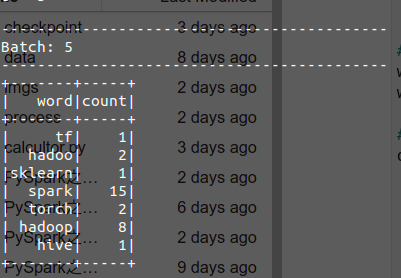

# PySpark之Structured Streaming基本操作
思想：将实时数据流视为一张正在不断添加的数据的表，可以把流计算等同于在一个静态表上的批处理查询，Spark会在不断添加数据的无界输入表上运行计算，并进行增量查询。  

编写Structured Streaming程序的基本步骤包括：  
- 导入pyspark模块
- 创建SparkSession对象
- 创建输入数据源
- 定义流计算过程
- 启动流计算并输出结果

两种处理模型：  
(1) 微批处理  
(2) 持续处理

## 词频统计
目标：一个包含很多英文语句的数据流远远不断到达，Structured Streaming程序对每行英文语句进行拆分，并统计每个单词出现的频率。  



```python
%%writefile structurednetworkwordcount.py
import findspark
findspark.init()
from pyspark.sql import SparkSession
from pyspark import SparkConf
from pyspark import Row
from pyspark.sql.functions import split, length
from pyspark.sql.functions import explode
import os 

ROOT = "file://" + os.getcwd()


# 创建SparkSession对象
spark = SparkSession.builder.appName("StructuredNetworkWordCount").getOrCreate()
spark.sparkContext.setLogLevel("WARN")
sc = spark.sparkContext

# 创建输入数据源
lines = spark.readStream \
    .format("socket") \
    .option("host", "localhost") \
    .option("port", 9999) \
    .load()

# 定义流计算过程
words = lines.select(explode(split(lines.value, " ")).alias("word"))
word_count = words.filter(length("word") == 5)

# 启动流计算并输出结果
query = word_count \
    .writeStream \
    .outputMode("complete") \
    .format("csv") \
    .option("path", ROOT + "/data/filesink") \
    .option("checkpointLocation", ROOT + "/data/file-sink-cp") \
    .trigger(processingTime="8 seconds") \
    .start()

query.awaitTermination()
```

    Overwriting structurednetworkwordcount.py


## 文件读写


```python
import os
import shutil
import random
import time
from tqdm import tqdm

TEST_DATA_TEMP_DIR = "./data/tmp/"
TEST_DATA_DIR = "./data/tmp/testdata/"
ACTION_DEF = ["login", "logout", "purchase"]
DISTRICT_DEF = ["fujian", "beijin", "shanghai", "guangzhou"]
JSIN_LINE_PATTERN = '{{"eventTime": {}, "action": {}, "district":{}}}\n'

def testSetUp():
    """创建临时文件目录"""
    
    if os.path.exists(TEST_DATA_DIR):
        shutil.rmtree(TEST_DATA_DIR, ignore_errors=True)
        
    os.mkdir(TEST_DATA_DIR)
    
def testTearDown():
    """恢复测试环境"""
    
    if os.path.exists(TEST_DATA_DIR):
        shutil.rmtree(TEST_DATA_DIR, ignore_errors=True)

def writeAndMove(filename, data):
    """生成测试文件"""
    
    with open(TEST_DATA_TEMP_DIR + filename, "wt", encoding="utf-8") as f:
        f.write(data)
    
    shutil.move(TEST_DATA_TEMP_DIR + filename, TEST_DATA_DIR + filename)

if __name__ == "__main__":
    
    testSetUp()
    
    for i in tqdm(range(500)):
        
        filename = 'e-mall-{}.json'.format(i)
        content = ''
        rndcount = list(range(100))
        random.shuffle(rndcount)
        
        for _ in rndcount:
            content += JSIN_LINE_PATTERN.format(str(int(time.time()))
                                                , random.choice(ACTION_DEF)
                                                , random.choice(DISTRICT_DEF)
                                               )
        writeAndMove(filename, content)
        time.sleep(1)
        
#     testTearDown()
```

    100%|██████████| 500/500 [08:22<00:00,  1.00s/it]


```python
%%writefile spark_ss_filesource.py
import findspark
findspark.init()
from pyspark.sql import SparkSession
from pyspark import SparkConf
from pyspark import Row
from pyspark.sql.functions import split
from pyspark.sql.functions import explode
from pyspark.sql.types import StructField, StructType
from pyspark.sql.types import StringType, TimestampType
from pyspark.sql.functions import window, asc


if __name__ == "__main__":
    import os
    
    TEST_DATA_DIR_SPARK = "file://" + os.getcwd() + "/data/tmp/testdata/"
    schema = StructType([StructField("eventTime", TimestampType(), True)
                         , StructField("action", StringType(), True)
                         , StructField("district", StringType(), True)
                        ])

    # 创建SparkSession对象
    spark = SparkSession.builder.appName("StructuredEmallPurchaseCount.py").getOrCreate()
    spark.sparkContext.setLogLevel("WARN")
    sc = spark.sparkContext

    # 创建输入数据源
    lines = spark.readStream \
        .format("json") \
        .schema(schema) \
        .option("maxFilesPerTrigger", 100) \
        .load(TEST_DATA_DIR_SPARK)

    # 定义流计算过程
    # 定义窗口：在指定的窗口时间内进行统计
    windowDuration = "1 minutes"
    words = lines.filter(lines.action == "purchase").groupBy("district", window("eventTime", windowDuration)).count().sort(asc("window"))

    # 启动流计算并输出结果
    query = words \
        .writeStream \
        .outputMode("complete") \
        .format("console") \
        .option("truncate", "false") \
        .trigger(processingTime="10 seconds") \
        .start()

    query.awaitTermination()
```

    Overwriting spark_ss_filesource.py


## 知识点
### explode的用法


```python
eDF = spark.createDataFrame([Row(a=1, intlist=[1,2,3], mapfield={"a": "b"})])
eDF.show()
```

    +---+---------+--------+
    |  a|  intlist|mapfield|
    +---+---------+--------+
    |  1|[1, 2, 3]|{a -> b}|
    +---+---------+--------+
    


```python
eDF.select(explode(eDF.intlist).alias("anInt")).show()
```

    +-----+
    |anInt|
    +-----+
    |    1|
    |    2|
    |    3|
    +-----+
    


```python
eDF.filter(eDF.a == 1).show()
```

    +---+---------+--------+
    |  a|  intlist|mapfield|
    +---+---------+--------+
    |  1|[1, 2, 3]|{a -> b}|
    +---+---------+--------+
    


## 参考
[Hadoop上传文件报错could only be written to 0 of the 1 minReplication nodes.](https://blog.csdn.net/sinat_38737592/article/details/101628357)
