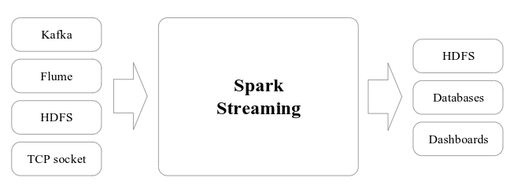
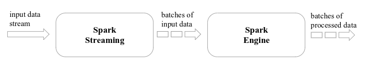
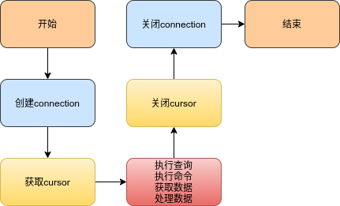
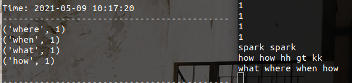
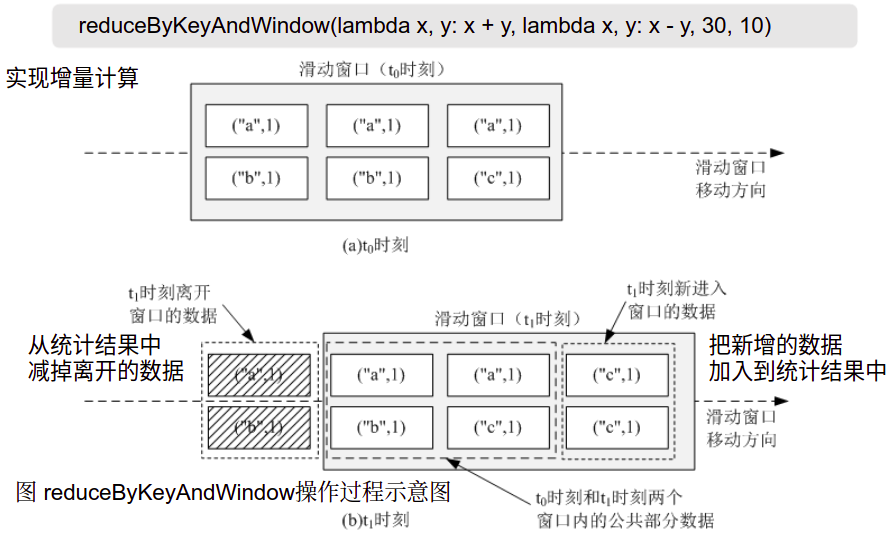

# PySpark之SparkStreaming基本操作
## 前言
流数据具有如下特征：  
•数据快速持续到达，潜在大小也许是无穷无尽的  
•数据来源众多，格式复杂  
•数据量大，但是不十分关注存储，一旦经过处理，要么被丢弃，要么被归档存储  
•注重数据的整体价值，不过分关注个别数据  
•数据顺序颠倒，或者不完整，系统无法控制将要处理的新到达的数据元素的顺序  

流计算(数据的价值随着时间的流式而降低)：  
实时获取来自不同数据源的海量数据，经过实时分析处理，获得有价值的信息  

流计算处理流程(强调实时性)：  
数据实时采集--->数据实时计算--->实时查询服务  
- 数据实时采集：数据实时采集阶段通常采集多个数据源的海量数据，需要保证实时性、低延迟与稳定可靠
- 数据实时计算：数据实时计算阶段对采集的数据进行实时的分析和计算，并反馈实时结果
- 实时查询服务：经由流计算框架得出的结果可供用户进行实时查询、展示或储存  

流处理系统与传统的数据处理系统有如下不同：
- 流处理系统处理的是实时的数据，而传统的数据处理系统处理的是预先存储好的静态数据
- 用户通过流处理系统获取的是实时结果，而通过传统的数据处理系统，获取的是过去某一时刻的结果
- 流处理系统无需用户主动发出查询，实时查询服务可以主动将实时结果推送给用户  

SparkStreaming操作：  
Spark Streaming可整合多种输入数据源，如Kafka、Flume、HDFS，甚至是普通的TCP套接字。经处理后的数据可存储至文件系统、数据库，或显示在仪表盘里。  
  
Spark Streaming的基本原理:  
是将实时输入数据流以时间片（秒级）为单位进行拆分，然后经Spark引擎以类似批处理的方式处理每个时间片数据（<font color = "red">伪实时,秒级响应</font>）  
  
Spark Streaming最主要的抽象:  
DStream（Discretized Stream，离散化数据流），表示连续不断的数据流。在内部实现上，Spark Streaming的输入数据按照时间片（如1秒）分成一段一段，每一段数据转换为Spark中的RDD，这些分段就是Dstream，并且对DStream的操作都最终转变为对相应的RDD的操作

## 基本操作
编写Spark Streaming程序的基本步骤是：  
1. 通过创建输入DStream来定义输入源  
2. 通过对DStream应用转换操作和输出操作来定义流计算  
3. 用streamingContext.start()来开始接收数据和处理流程  
4. 通过streamingContext.awaitTermination()方法来等待处理结束（手动结束或因为错误而结束）  
5. 可以通过streamingContext.stop()来手动结束流计算进程  

### RDD队列流

**知识点**：  
Spark中foreachRDD、foreachPartition和foreach 的区别：  
    首先是作用范围不同，foreachRDD 作用于 DStream中每一个时间间隔的 RDD，foreachPartition 作用于每一个时间间隔的RDD中的每一个 partition，foreach 作用于每一个时间间隔的 RDD 中的每一个元素。  
输出mysql流程：  



```python
%%writefile rdd_queue.py

import findspark  
findspark.init()
from pyspark import SparkContext, SparkConf
from pyspark.streaming import StreamingContext
from pyspark.sql.session import SparkSession
import time
import os
import pymysql

# 环境配置
conf = SparkConf().setAppName("RDD Queue").setMaster("local")
sc = SparkContext(conf=conf)
ssc = StreamingContext(sc, 2)


# 创建RDD数据流
rddQueue = []
for i in range(5):
    rddQueue += [ssc.sparkContext.parallelize([j for j in range(100 + i)], 10)]
    time.sleep(1)
    
inputStream = ssc.queueStream(rddQueue)
reduceedStream = inputStream.map(lambda x: (x%10, 1)).reduceByKey(lambda x, y: x + y)
# 方法一：保存值到指定文本文件中
# reduceedStream.saveAsTextFiles("file://" + os.getcwd() + "/process/") 
# 方法二：保存数据到mysql数据库中
def db_func(records):
    
    # 连接数据库
    # 连接mysql数据库
    print("正在连接数据库中!")
    db = pymysql.connect(host='localhost',user='root',passwd='123456',db='spark')
    cursor = db.cursor()
    def do_insert():
        # sql语句
        print("Inserting data!")
        sql = " insert into wordcount(word, count) values ('%s','%s')" % (str(p[0]), str(p[1]))
        try:
            cursor.ececute(sql)
            db.commit()
        except:
            # 回滚
            db.rollback()
        for item in recorders:
            do_insert(item)
            
def func(rdd):
    
    repartitionedRDD = rdd.repartition(3)
    repartitionedRDD.foreachPartition(db_func)

reduceedStream.pprint()
reduceedStream.foreachRDD(func)

ssc.start()
ssc.stop(stopSparkContext=True, stopGraceFully=True)
```

```python
%run rdd_queue.py
```

    -------------------------------------------
    Time: 2021-05-11 15:01:30
    -------------------------------------------
    (0, 10)
    (1, 10)
    (2, 10)
    (3, 10)
    (4, 10)
    (5, 10)
    (6, 10)
    (7, 10)
    (8, 10)
    (9, 10)
    
    -------------------------------------------
    Time: 2021-05-11 15:01:32
    -------------------------------------------
    (0, 11)
    (1, 10)
    (2, 10)
    (3, 10)
    (4, 10)
    (5, 10)
    (6, 10)
    (7, 10)
    (8, 10)
    (9, 10)

### 词频统计(无状态操作)
说明：无状态转换，每次统计，都是只统计当前批次到达的单词词频，和之前批次无关，不会进行累计。  
输出结果显示:  



```python
%%writefile sscrun.py
import findspark  
findspark.init()
from pyspark import SparkContext
from pyspark.streaming import StreamingContext

# 创建环境
sc = SparkContext(master="local[2]", appName="NetworkWordCount")
ssc = StreamingContext(sc, 1)  # 每隔一秒钟监听一次数据

# 监听端口数据(socket数据源)
lines = ssc.socketTextStream("localhost", 9999)
#　拆分单词
words = lines.flatMap(lambda line: line.split(" "))
# 统计词频
pairs = words.map(lambda word:(word, 1))
wordCounts = pairs.reduceByKey(lambda x, y:x+y)
# 打印数据
wordCounts.pprint()

# 开启流式处理
ssc.start()
ssc.awaitTermination(timeout=10)
```

```python
%run sscrun.py
```

    -------------------------------------------
    Time: 2021-05-11 14:46:11
    -------------------------------------------
    ('', 1)
    ('1', 1)
    ('\x1b[F', 1)
    ('\x1b[F1', 1)

### 词频统计(有状态操作)
说明：对于有状态装换操作而言，本批次的词频统计，会在之前批次的词频统计结果的基础上进行不断累加，所以，最终统计得到的词频，是所有批次的单词的词频的统计结果。
```python
更新函数：
words.updateStateByKey(updateFunc, numPartitions=None, initialRDD=None)
```

```python
%%writefile calcultor.py

import findspark  
findspark.init()
from pyspark import SparkContext
from pyspark.streaming import StreamingContext
import os 
# 创建环境
sc = SparkContext(master="local[2]", appName="NetworkWordCounts")
ssc = StreamingContext(sc, 3)  # 每隔一秒钟监听一次数据
# 监听端口数据
lines = ssc.socketTextStream("localhost", 9999)
#　拆分单词
words = lines.flatMap(lambda line: line.split(" "))

# 设置检测点(写入到当前文件系统中)
ssc.checkpoint("file://" + os.getcwd() + "checkpoint")

# 状态更新函数
def updatefun(new_values,last_sum):
    
    # 向前转态加上当前状态的key状态的value值
    # eg(初始状态):
    # new_values = [1, 1, 1], last_sum = 0
    return sum(new_values) + (last_sum or 0)  # 初始转态为零

# 监听端口数据
lines = ssc.socketTextStream("localhost", 9999)
#　拆分单词
words = lines.flatMap(lambda line: line.split(" "))
#  统计词频
pairs = words.map(lambda word:(word, 1))
wordCounts = pairs.updateStateByKey(updateFunc=updatefun)
wordCounts.pprint()

ssc.start()
ssc.awaitTermination()
```


```python
%run calcultor.py
```

    -------------------------------------------
    Time: 2021-05-10 15:09:45
    -------------------------------------------
    ('1', 5)
    ('12', 3)
    ('54', 1)
    ('4', 1)
    ('11', 1)
    ('6', 1)
    ('5', 1)


### Windows（有转态操作）
```python
更新函数：
lines.reduceByKeyAndWindow(
    func,  # 统计函数
    invFunc,  # 逆统计函数
    windowDuration,  # 窗口大小
    slideDuration=None,  # 窗口更新频率
    numPartitions=None,
    filterFunc=None,
)
```
计算图示：



```python
%%writefile top.py

import findspark  
findspark.init()
from pyspark import SparkContext
from pyspark.streaming import StreamingContext
from pyspark.sql.session import SparkSession

def get_countryname(line):
    country_name = line.strip()  # 消除空格

    if country_name == 'usa':
        output = 'USA'
    elif country_name == 'ind':
        output = 'India'
    elif country_name == 'aus':
        output = 'Australia'
    else:
        output = 'Unknown'

    return (output, 1)

# 设置参数
batch_interval = 1
window_length = 6*batch_interval  # 窗口大小
frquency = 3*batch_interval  # 滑动频率

sc =  sc = SparkContext(master="local[2]", appName="NetworkWordCount")
ssc = StreamingContext(sc, batch_interval)

ssc.checkpoint("checkpoint")
# 监听端口数据
lines = ssc.socketTextStream("localhost", 9999)

addFunc = lambda x, y: x+y
invAddFunc = lambda x, y: x-y
word_counts = lines.map(get_countryname).reduceByKeyAndWindow(addFunc, invAddFunc, window_length, frquency)
word_counts.pprint()

ssc.start()
ssc.awaitTermination()
```

```python
%run top.py
```


## 参考
[Spark 中foreachRDD、foreachPartition和foreach解读](https://zhuanlan.zhihu.com/p/109370556)  
[MySQL之Python与Mysql交互](https://www.cnblogs.com/huiyichanmian/p/11228192.html)